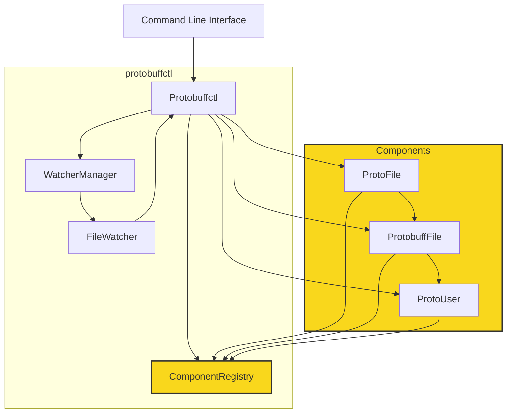

--made some major changes to the logic
# protobuffctl 
- watches for filechanges in your proto files.
- automatically generates protobuff files for all your backends and languages
- automatically generate demo code for your services and messeages
-  Protobuffs for many available languages are getting created using my <a href="https://github.com/ji-podhead/protoc-helper">protoc-helper repo</a>. it uses  compiled protoc binary with javascript
-  creates a libary of all your protobuff apearances and proto types,serices,enums, etc **[see example json](https://github.com/ji-podhead/protobuffctl/blob/main/protobuffctl.json)**
-  browse trough your components in vs code extension. click on a listed file to open it


# Update
- fast saving and loading, but also added a daemon to keep the mainObject alive including the registry
- protobuffregistry+creation is working fine
- added:export the registry to json **[see example json](https://github.com/ji-podhead/protobuffctl/blob/main/protobuffctl.json)**
- all components are getting stored and can get reproduced
- create new services, types, enums via cli command by coping from the registry or via command
- proto files are edited trough api rather than trough texteditor => related protobufffiles will automatically get compiled to their target folders using <a href="https://github.com/ji-podhead/protoc-helper">protoc-helper repo</a>
> **files and object cant be redundant***, however if failures arise due to the user, or missing drives, the config/save-file can get damaged which can lead to weird behaviour when automated processes are using the faulty objects, so i decided to add a health-state field for each object. **unhealthy files will be ignored** and not further processed, but also the main statehandler wont delete that file, if it may become usuable again later.

> **add health_state field**

> **add health check**

> **add a merge function for the user** if he had misconfigurations but wants to copy the fields back over to a healthy file 
# Protobuffctl CLI Documentation
Protobuffctl has a command-line interface (CLI) tool designed to manage components and watchers for a project,   possibly related to Protocol Buffers (protobuf). This documentation provides an overview of the available commands and their usage. `The the export module functions do exactly the same`
## Commands
### add 
> **Description:** Adds a watcher for the specified file path.

**Parameters:**
- `filePath`: The path to the file you want to watch.
```javascript
 node main.js add /path/to/your/file
 ````
---
### remove 
> **Description:** Removes the watcher for the specified file path.

**Parameters:**
- `filePath`: The path to the file you want to stop watching.
```javascript
 node main.js remove /path/to/your/file
 ````
---
### startAll
> **Description:** Starts all watchers.
```javascript
 node main.js startAll
 ````
---
### stopAll
> **Description:** Stops all watchers.
```javascript
 node main.js stopAll
 ````
---
### init
> **Description:** Initializes the tool using your protobuffctl.json configuration file.
```javascript
 node main.js init
 ````
---
### generateProtobuff 
> **Description:** Generates a protobuf file in the specified language.

**Parameters:**
- `language`: The language for which the protobuf file should be generated.
- `proto_path`: The path to the directory containing the protobuf files.
- `proto_file`: The path to the specific protobuf file to generate.
- `outputPath`: The path to the directory where the generated file should be saved.
```javascript
 node main.js generateProtobuff java /path/to/proto/files /path/to/proto/file.proto /path/to/output
 ````
---
### createComponent
**Description:** Creates a component with the specified type and arguments.

**Parameters:**
- `type`: The type of the component to create.
- `args...`: A variable number of arguments to pass to the component creation function. Arguments should be comma-separated.
```javascript
 node main.js createComponent yourComponentType arg1,arg2,arg3
 ````
