# protobuffctl
`protobuffctl` is an api to automate protobuff workflows.
`protobuffctl` offers an  API that enables you to automate all protobuf functions. **Automatic Protobuf Generation**: Whenever you make changes to your protobuf definitions, `protobuffctl` can automatically generate the corresponding protobuf files. **Registry Management**: Export your configs to roll back all your Protofiles saved in the .config **File Watching**: Monitor your proto files for any changes. With `protobuffctl`, you can set up watchers to automatically detect modifications, ensuring that your project stays up-to-date with the latest protobuf definitions. **Component Creation**: Quickly create new types, fields, and services. Whether you need to define a new message type, add a service method, or create an enum, **User Interface (UI)**: Create your own ui and to manage `Protocollbuffers` using the api. **VC CODE EXTENSION**: Get complete visual feedback for all related methods, components, and files directly in your IDE. This feature is currently under development but will enhance your development experience by providing real-time updates and insights into your protobuf project.

## Getting Started
> commng up/

## Documentation
Protobuffctl has a command-line interface (CLI) tool designed to manage components and watchers for a project,   possibly related to Protocol Buffers (protobuf). This documentation provides an overview of the available commands and their usage. `The the export module functions do exactly the same`
## API Documentation

**getAll**
```javascript
getAll("<type>", <describe>, <jsonOut>);
```
Retrieves all elements of a specified type from the registry.
- `type`: The type of elements to retrieve (e.g., "protoFiles", "services", "methods", etc.).
- `describe`: A boolean indicating whether to describe the elements in detail.
- `jsonOut`: A boolean indicating whether to output the results in JSON format.
  
**get**
```javascript
get("<type>", "<name>", <depth>);
```
Retrieves a specific component from the registry.
- `type`: The type of the component to retrieve.
- `name`: The name of the component to retrieve.
- `depth`: The depth of recursion for retrieving related components.
  
**toJson**
```javascript
toJson("<out>", "<id>");
```
Converts the registry to a JSON file.
- `out`: The output path for the JSON file.
- `id`: The ID of the component to include in the JSON file.

**remove**
```javascript
remove("<type>", "<name>", <values>, <pull>);
```
Removes a component from another component.
- `type`: The type of the component to remove.
- `name`: The name of the component to remove.
- `values`: The values associated with the component to remove.
- `pull`: A boolean indicating whether to pull the changes to the registry.

**findAllUsages**
```javascript
findAllUsages("<type>", "<name>");
```
Finds all usages of a specified component in the registry.

- `type`: The type of the component to find usages for.
- `name`: The name of the component to find usages for.

**add**
```javascript
add("<type>", "<source>", "<target>", <pull>);
```
Adds a component to another component.
- `type`: The type of the component to add.
- `source`: The name of the source component.
- `target`: The name of the target component.
- `pull`: A boolean indicating whether to pull the changes to the registry.

**del**
```javascript
del("<type>", "<id>", <remove_from_components>);
```
Deletes a component from the registry.
- `type`: The type of the component to delete.
- `id`: The ID of the component to delete.
- `remove_from_components`: A boolean indicating whether to remove the component from other components.

**protogenArr**
```javascript
protogenArr(<protofiles>);
```
Generates Protobuff files for an array of proto files.
- `protofiles`: An array of proto file names or IDs.
  
**pull**
```javascript
pull(<protoFiles>, <remove_missing>);
```
Updates the registry with changes from the specified proto files.

**push**
- `protoFiles`: An array of proto file names or IDs.
- `remove_missing`: A boolean indicating whether to remove missing components from the registry.
```javascript
push(<protoFiles>, <remove_missing>);
```
Updates the proto files with changes from the registry.
- `protoFiles`: An array of proto file names or IDs.
- `remove_missing`: A boolean indicating whether to remove missing components from the proto files.

**createFromConfig**
```javascript
createFromConfig(<protoFiles>);
```
Creates components from a configuration file.
- `protoFiles`: An array of proto file names or IDs.

**create**
```javascript
create("<type>", "<arg1>", "<arg2>", "<arg3>");
```
Initializes a new Proto-object or ProtobuffFile in the registry.

- `type`: The type of object to create (e.g., "proto", "protobuff").
- `arg1`: The first argument, which is the file name for "proto" type or the protoFile ID for "protobuff" type.
- `arg2`: The second argument, which is the file path for "proto" type or the language for "protobuff" type.
- `arg3`: The third argument, which is the output path for "protobuff" type.
- `arg4`: The fourth argument, which is not used in the current implementation.

---

# Flowchart

```mermaid
graph TD;
    CLI["💻 Command Line Interface"]-->Api;
CLI["💻 Command Line Interface"]-->Daemon;
    Api-->WatcherManager;
    Api-->ComponentRegistry;
    WatcherManager-->FileWatcher;
    FileWatcher-->Api;
    Api-->ProtobuffFile;
    Api-->ProtoUser;
    Api-->ProtoFile;
    ProtoFile-->ProtobuffFile;
    ProtoFile-->ComponentRegistry;
    ProtobuffFile-->ProtoUser;
    ProtobuffFile-->ComponentRegistry;
    ProtoUser-->ComponentRegistry;
  Daemon-->Api;
    subgraph protobuffctl [🏢 protobuffctl]
        Api;
        WatcherManager;
        FileWatcher;
        ComponentRegistry;
    end
    subgraph components [🔧 Components]
        ProtoFile;
        ProtobuffFile;
        ProtoUser;
    end
    style components fill:#f9d71c,stroke:#333,stroke-width:2px
    style ComponentRegistry fill:#f9d71c,stroke:#333,stroke-width:2px
    style components fill:#f9d71c,stroke:#333,stroke-width:2px
    style ComponentRegistry fill:#f9d71c,stroke:#333,stroke-width:2px
    style Daemon fill:#f9d71c,stroke:#333,stroke-width:2px

```



### Update
- **Fast Saving and Loading**: Added a daemon to keep the main object alive, including the registry.
- **Protobuff Registry**: Protobuff registry and creation are working fine.
- **Export to JSON**: All components are stored and can be reproduced. [See example JSON](https://github.com/ji-podhead/protobuffctl/blob/main/protobuffctl.json).
- **New Services, Types, Enums**: Create new services, types, enums via CLI command by copying from the registry or via command. 
- **automated Proto-gen**:  Related protobuf files will automatically get compiled to their target folders using the [protoc-helper repo](https://github.com/ji-podhead/protoc-helper).
- this thing works, which is nice. complete api to edit your protobuff  projects and files. you can set every important value via cli know and ill add support to get all protofiles from certain folders.
- you can apply changes via api know -> registry is getting updated -> protofiles are getting updates -> *protobuff-files are getting upddated* <- i actually need to implement that :)  but my db was created as a wrapper for protobuffjs, so i just need a bridge/method
### TODO
> **files and object cant be redundant**, however if failures arise due to the user, or missing drives, the config/save-file can get damaged which can lead to weird behaviour when automated processes are using the faulty objects, so i decided to add a health-state field for each object. **unhealthy files will be ignored and not further be processed**, but also the main statehandler wont delete that file, if it may become usuable again later.
- **Health State Field**: Add a health-state field for each object to handle failures and misconfigurations.
- **Health Check**: Add a health check to ensure the integrity of the objects.
- ~~**Merge Function**: Add a merge function for the user to copy fields back over to a healthy file if there were misconfigurations.~~


