# protobuffctl

`protobuffctl` is a tool designed to manage components and watchers for a project related to Protocol Buffers (protobuf). It provides a comprehensive set of features to streamline the development process:

- **Registry Management**: Registers all your proto-files, proto-Users, callbacks, components (fields, services, enums, etc.). [See example JSON](https://github.com/ji-podhead/protobuffctl/blob/main/protobuffctl.json).
- **File Watching**: Watches for file changes in your proto files.
- **Component Creation**: Create new types, fields, and services from presets, or a copy from the registry.
- **Protobuf Generation**: Automatically generates protobuf files for all your backends and languages using the [protoc-helper repo](https://github.com/ji-podhead/protoc-helper).
- **Procedural Code Generation**: Generates procedural code in protoUserFiles using the given clients, methods, etc. `todo`
- **Visual Feedback**: Provides complete visual feedback for all related methods, components, and files directly in your IDE. `todo`
- **UI/VS Code Extension**: Browse, manage, edit, and create your files, components, and implementations via UI or VS Code extension. `todo`



```mermaid
graph TD;
    CLI["💻 Command Line Interface"]-->Api;
CLI["💻 Command Line Interface"]-->Daemon;
    Api-->WatcherManager;
    Api-->ComponentRegistry;
    WatcherManager-->FileWatcher;
    FileWatcher-->Api;
    Api-->ProtobuffFile;
    Api-->ProtoUser;
    Api-->ProtoFile;
    ProtoFile-->ProtobuffFile;
    ProtoFile-->ComponentRegistry;
    ProtobuffFile-->ProtoUser;
    ProtobuffFile-->ComponentRegistry;
    ProtoUser-->ComponentRegistry;
  Daemon-->Api;
    subgraph protobuffctl [🏢 protobuffctl]
        Api;
        WatcherManager;
        FileWatcher;
        ComponentRegistry;
    end
    subgraph components [🔧 Components]
        ProtoFile;
        ProtobuffFile;
        ProtoUser;
    end
    style components fill:#f9d71c,stroke:#333,stroke-width:2px
    style ComponentRegistry fill:#f9d71c,stroke:#333,stroke-width:2px
    style components fill:#f9d71c,stroke:#333,stroke-width:2px
    style ComponentRegistry fill:#f9d71c,stroke:#333,stroke-width:2px
    style Daemon fill:#f9d71c,stroke:#333,stroke-width:2px

```

### Update
- **Fast Saving and Loading**: Added a daemon to keep the main object alive, including the registry.
- **Protobuff Registry**: Protobuff registry and creation are working fine.
- **Export to JSON**: All components are stored and can be reproduced. [See example JSON](https://github.com/ji-podhead/protobuffctl/blob/main/protobuffctl.json).
- **New Services, Types, Enums**: Create new services, types, enums via CLI command by copying from the registry or via command. 
- **automated Proto-gen**:  Related protobuf files will automatically get compiled to their target folders using the [protoc-helper repo](https://github.com/ji-podhead/protoc-helper).
- this thing works, which is nice. complete api to edit your protobuff  projects and files. you can set every important value via cli know and ill add support to get all protofiles from certain folders.
- you can apply changes via api know -> registry is getting updated -> protofiles are getting updates -> *protobuff-files are getting upddated* <- i actually need to implement that :) 
### TODO
> **files and object cant be redundant**, however if failures arise due to the user, or missing drives, the config/save-file can get damaged which can lead to weird behaviour when automated processes are using the faulty objects, so i decided to add a health-state field for each object. **unhealthy files will be ignored and not further be processed**, but also the main statehandler wont delete that file, if it may become usuable again later.
- **Health State Field**: Add a health-state field for each object to handle failures and misconfigurations.
- **Health Check**: Add a health check to ensure the integrity of the objects.
- **Merge Function**: Add a merge function for the user to copy fields back over to a healthy file if there were misconfigurations.
- **Component Creator**: Edited through the API rather than through a text editor.
- **user Watcher**: Add a watcher for the Users to update the registry if files are changed.

# Protobuffctl CLI Documentation
Protobuffctl has a command-line interface (CLI) tool designed to manage components and watchers for a project,   possibly related to Protocol Buffers (protobuf). This documentation provides an overview of the available commands and their usage. `The the export module functions do exactly the same`
## Commands
### add 
> **Description:** Adds a watcher for the specified file path.

**Parameters:**
- `filePath`: The path to the file you want to watch.
```javascript
 node main.js add /path/to/your/file
 ````
---
### remove 
> **Description:** Removes the watcher for the specified file path.

**Parameters:**
- `filePath`: The path to the file you want to stop watching.
```javascript
 node main.js remove /path/to/your/file
 ````
---
### startAll
> **Description:** Starts all watchers.
```javascript
 node main.js startAll
 ````
---
### stopAll
> **Description:** Stops all watchers.
```javascript
 node main.js stopAll
 ````
---
### init
> **Description:** Initializes the tool using your protobuffctl.json configuration file.
```javascript
 node main.js init
 ````
---
### generateProtobuff 
> **Description:** Generates a protobuf file in the specified language.

**Parameters:**
- `language`: The language for which the protobuf file should be generated.
- `proto_path`: The path to the directory containing the protobuf files.
- `proto_file`: The path to the specific protobuf file to generate.
- `outputPath`: The path to the directory where the generated file should be saved.
```javascript
 node main.js generateProtobuff java /path/to/proto/files /path/to/proto/file.proto /path/to/output
 ````
---
### createComponent
**Description:** Creates a component with the specified type and arguments.

**Parameters:**
- `type`: The type of the component to create.
- `args...`: A variable number of arguments to pass to the component creation function. Arguments should be comma-separated.
```javascript
 node main.js createComponent yourComponentType arg1,arg2,arg3
 ````
