# protobuffctl
`protobuffctl` offers an  [API](https://ji-podhead.github.io/protobuffctl/) that enables you to automate all protobuf functions. it stores all Components in the **Componentregistry**.  
> Quickly create new types, fields, and services, message types, service methods and enums using the [API](https://ji-podhead.github.io/protobuffctl/) and **cli commands**. 
> `protobuffctl` automatically generates the corresponding protobuf files when making changes to the protofiles. 
> Roll back to old protofile, or to an historical registry state using historical `.config` file just like with **version control**. 
> **Preview** the Protofile-Code before actually building it. 
> Set up **File Watcher** to monitor your proto files for any changes. Update the Componentregistry and rescan Protofile when user modifies them. 
> Create your own **User Interface** and manage `Protocollbuffers` using the api and input events. 
>`COMMING UP` Get complete visual feedback for all related methods, components, and files directly with our **VC CODE EXTENSION**.  

## Getting Started
> commng up/

## Documentation
- docs are [here](https://ji-podhead.github.io/protobuffctl/)
  
Protobuffctl has a command-line interface (CLI) tool designed to manage components and watchers for a project,   possibly related to Protocol Buffers (protobuf). This documentation provides an overview of the available commands and their usage.  `The the export module functions do exactly the same`

---

# Flowchart

```mermaid
graph TD;
    CLI["💻 Command Line Interface"]-->Api;
CLI["💻 Command Line Interface"]-->Daemon;
    Api-->WatcherManager;
    Api-->ComponentRegistry;
    WatcherManager-->FileWatcher;
    FileWatcher-->Api;
    Api-->ProtobuffFile;
    Api-->ProtoUser;
    Api-->ProtoFile;
    ProtoFile-->ProtobuffFile;
    ProtoFile-->ComponentRegistry;
    ProtobuffFile-->ProtoUser;
    ProtobuffFile-->ComponentRegistry;
    ProtoUser-->ComponentRegistry;
  Daemon-->Api;
    subgraph protobuffctl [🏢 protobuffctl]
        Api;
        WatcherManager;
        FileWatcher;
        ComponentRegistry;
    end
    subgraph components [🔧 Components]
        ProtoFile;
        ProtobuffFile;
        ProtoUser;
    end
    style components fill:#f9d71c,stroke:#333,stroke-width:2px
    style ComponentRegistry fill:#f9d71c,stroke:#333,stroke-width:2px
    style components fill:#f9d71c,stroke:#333,stroke-width:2px
    style ComponentRegistry fill:#f9d71c,stroke:#333,stroke-width:2px
    style Daemon fill:#f9d71c,stroke:#333,stroke-width:2px

```

### Update
- **Fast Saving and Loading**: Added a daemon to keep the main object alive, including the registry.
- **Protobuff Registry**: Protobuff registry and creation are working fine.
- **Export to JSON**: All components are stored and can be reproduced. [See example JSON](https://github.com/ji-podhead/protobuffctl/blob/main/protobuffctl.json).
- **New Services, Types, Enums**: Create new services, types, enums via CLI command by copying from the registry or via command. 
- **automated Proto-gen**:  Related protobuf files will automatically get compiled to their target folders using the [protoc-helper repo](https://github.com/ji-podhead/protoc-helper).
- this thing works, which is nice. complete api to edit your protobuff  projects and files. you can set every important value via cli know and ill add support to get all protofiles from certain folders.
- you can apply changes via api know -> registry is getting updated -> protofiles are getting updates -> *protobuff-files are getting upddated* <- i actually need to implement that :)  but my db was created as a wrapper for protobuffjs, so i just need a bridge/method
### TODO
> **files and object cant be redundant**, however if failures arise due to the user, or missing drives, the config/save-file can get damaged which can lead to weird behaviour when automated processes are using the faulty objects, so i decided to add a health-state field for each object. **unhealthy files will be ignored and not further be processed**, but also the main statehandler wont delete that file, if it may become usuable again later.
- **Health State Field**: Add a health-state field for each object to handle failures and misconfigurations.
- **Health Check**: Add a health check to ensure the integrity of the objects.
- ~~**Merge Function**: Add a merge function for the user to copy fields back over to a healthy file if there were misconfigurations.~~

